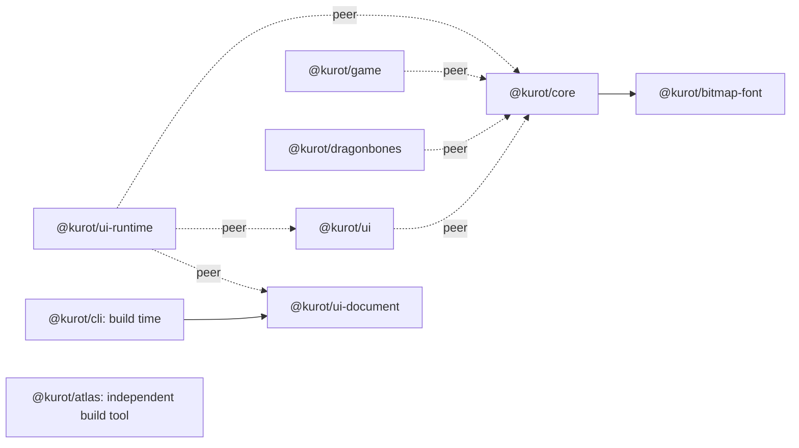

# Dependencies and independent releases

Kurot packages have independent versions. A dependency release is a reason to
check affected consumers, not an instruction to bump every consumer version.
Refreshing a development lockfile is maintenance; publishing a changed runtime
or a changed compatibility requirement is a release.

## Package graph

Arrows point from a consumer to its dependency. Solid arrows are ordinary
dependencies; dashed arrows are peer compatibility requirements.



The manifests are authoritative. Published-baseline Kurot package requirements are:

| Package     | Ordinary Kurot dependency | Kurot peers                                       | Purpose                                                         |
| ----------- | ------------------------- | ------------------------------------------------- | --------------------------------------------------------------- |
| core        | bitmap-font `^0.1.0`      | None                                              | Headless font parsing and layout used by native rendering.      |
| ui          | None                      | core `^2.4.0`                                     | Components use the application's Core objects.                  |
| game        | None                      | core `^2.0.0`                                     | Game helpers use the application's Core objects and ticker.     |
| dragonbones | None                      | core `^2.1.1`                                     | Animation displays and meshes use the application's Core.       |
| ui-runtime  | None                      | core `^2.4.0`, ui `^3.4.0`, ui-document `^0.13.0` | Materializes a document into the application's Core/UI objects. |
| cli         | ui-document `^0.13.0`     | None                                              | Compiles KUI at build time.                                     |
| ui-document | None                      | None                                              | Headless authoring, validation and serialization.               |
| bitmap-font | None                      | None                                              | Headless font data, validation and layout.                      |
| atlas       | None                      | None                                              | Independent pixel packing with a Node PNG subpath.              |

Core 2.3.2 is published with render-only text-outline margins. This correction adds no API
or resource-format requirement. UI 3.3.0/runtime 0.9.0 and Game/DragonBones/Spine
peers accept 2.3.2 without another SDK release or raised minimum. Current
UI 3.4.0/runtime 0.10.0 require Core ^2.4.0 for centered flips; that release
includes this text-outline correction.
Development lock adoption is optional. Editor 0.22.1's local trial pins published
Core 2.3.2 with an updated Bun lockfile and rebuild. Reskin,
examples and Core 2.x templates can adopt it through their accepted ranges and
updated locks; existing installations stay unchanged. CLI/ui-document/atlas/
bitmap-font do not depend on Core, and legacy Core 1.x projects are unaffected.

Core 2.3.1 and UI 3.3.0 are published. The Core patch
fixes unstyled blank rich-run heights without new API requirements. UI raises its real Core
minimum because RichLabel uses the new TextField.measureText API. UI 3.3.0 release development
dependencies and its lockfile resolve Core 2.3.1 from npm without overrides.
Published UI 3.2.0 keeps Core ^2.2.0; Game, DragonBones, Spine and runtime 0.8.2
accept Core 2.3.0. They need no release merely to accept it.
Applications/templates adopt installed versions separately. The initial KUI
CLI 3.4.0 and ui-runtime 0.9.0 integrations are published with the new registrations;
older catalog/materializer implementations do not acquire RichLabel support
through a compatible Core/UI lock update.

Third-party tools are separate from this graph. Core's linebreak package is a
runtime dependency; Atlas's PNG adapter uses pngjs. TypeScript, Vitest, esbuild
used by tests, and browser test tools are development dependencies. The CLI's
esbuild is a dependency of the build tool, not a game runtime dependency.

Core does not depend on UI, Game, ui-runtime, DragonBones or Atlas. UI does not
depend directly on bitmap-font. CLI-built skins do not require ui-runtime.
Editor can combine font and atlas editing while their headless packages remain
independent; a shared editor does not require a shared runtime package.

Keep Core/UI as peers where consumers exchange native objects. Verify that an
application resolves a compatible shared Core instance; a peer declaration
alone does not prove that its installed dependency tree has no duplicate engine.

## Three different version concerns

| Field or file                 | Meaning                                                            | When to change it                                                                                                  |
| ----------------------------- | ------------------------------------------------------------------ | ------------------------------------------------------------------------------------------------------------------ |
| `dependencies`                | Code or data contract consumed by the package.                     | When adopting an API or behavior that requires a newer minimum, or migrating to an incompatible line.              |
| `peerDependencies`            | Supported host versions, starting at the real minimum requirement. | When the consumer starts requiring a new API/contract, changes supported host lines, or corrects invalid metadata. |
| `devDependencies`             | Versions allowed for building and testing this checkout.           | When deliberately changing the development/test baseline.                                                          |
| `pnpm-lock.yaml` / `bun.lock` | Exact versions installed for this checkout/application.            | When deliberately adopting an update; keep frozen installs for reproduction.                                       |
| Package `version`             | Identity of a published artifact.                                  | When publishing changed shipped behavior, API, types, compatibility or other requested release content.            |

Use compatible ranges for SDK dependencies and peers, with a lower bound based
on what the package actually needs. Never copy the latest Core version into
every peer minimum. Development ranges can be newer than peer minima; their
lockfiles record the version actually tested. Keep the promised minimum in
compatibility validation when changing code that might depend on newer APIs.

Updating only development declarations or lockfiles does not require an SDK
version bump or an npm publication. A development update that changes generated
or bundled shipped output must be assessed as an artifact change instead.
Do not republish an existing name/version with different contents.

Applications own their upgrade schedule. Exact dependencies are acceptable for
desktop products; ranges plus committed lockfiles are acceptable for projects.
To deliver a dependency fix inside a bundled application, update its dependency
tree, rebuild and follow that application's version/release rules. This does not
require publishing new versions of unchanged SDK packages.

## Release impact rules

| Change                                                      | Release scope                                                                               | Consumer adoption                                                                                                                     |
| ----------------------------------------------------------- | ------------------------------------------------------------------------------------------- | ------------------------------------------------------------------------------------------------------------------------------------- |
| Compatible fix to an externally resolved dependency         | Release the package containing the fix.                                                     | Consumers whose ranges accept it may update their installations/lockfiles. Unchanged SDKs keep their versions and peer minima.        |
| New optional API or feature                                 | Release the package adding it.                                                              | Release only consumers that implement/adopt it, with accurate minimum requirements. Other consumers stay on their existing contracts. |
| Removed/changed API or incompatible data contract           | Release the breaking package on the appropriate incompatible version line.                  | Migrate and release affected consumers; expand support only after validating each claimed line.                                       |
| Incorrect peer metadata                                     | Release the package with corrected metadata.                                                | Verify compatibility rather than masking the conflict with a permanent override.                                                      |
| Development/test baseline refresh                           | No SDK release when shipped output and compatibility remain unchanged.                      | Update the chosen package's development installation and run its checks.                                                              |
| Compatible dependency update embedded in a published bundle | Rebuild the package or application that embeds it; version it if publishing changed output. | Treat each changed artifact separately; externally resolved consumers still need no blanket version bump.                             |

For a dependency change, classify each direct consumer as one of:

1. **Required migration to adopt the target:** its declared range excludes the
   target, or its code, generated output or data contract must change. A consumer
   can stay on a supported existing version when adoption is not required.
2. **Optional adoption:** the range accepts the target and the installed/locked
   version is older. Adopt the fix when useful; this is not a release obligation.
3. **Unaffected:** no relevant dependency or already using the required behavior.

Propagate the analysis to downstream consumers only when the direct consumer's
shipped behavior or compatibility changes. Do not turn the dependency graph into
an automatic sequence of package version bumps.

## Default text alignment: Core 2.5.3 and document 0.13.1

Both patches are published, verified on npm on 2026-10-10. Core TextField/BitmapText and inherited
UI text components default to middle. Document's catalog reports the same default
for Label, EditableText, RichLabel and BitmapLabel, while omitted XML properties
stay omitted. Explicit top/bottom, named states, line modes and format 2 remain
unchanged. Old content with omitted alignment can move inside a taller box;
set top explicitly when that placement is intended.

- Required adoption: applications install Core 2.5.3 and rebuild to use the new
  runtime default. Editors adopt document 0.13.1 alongside Core so their inspectors
  and previews agree. Editor 0.27.5 removes the rich-text top fallback and restores
  its native instance default. The four explicitly requested applications now
  install Core 2.5.3/document 0.13.1 with matching locks and rebuilt outputs;
  Editor 0.27.5 is a local trial, not a remote release.
- Optional adoption: accepted SDK development installations/locks can update for
  verification. Existing Core peers in UI (^2.4.0), Game (^2.0.0),
  DragonBones (^2.1.1), Spine (Core 2.x) and ui-runtime (^2.4.0) already accept
  Core 2.5.3. CLI 3.6.0/runtime 0.10.0 accept
  document 0.13.1 through ^0.13.0. No SDK version bump or raised peer minimum is
  needed merely to inherit these defaults.
- Unaffected: Atlas and the headless bitmap-font kernel have no changed behavior
  or release. BitmapText passes its explicit alignment into the existing kernel;
  its standalone layout default stays top. Existing application installations,
  copied projects, manifests and locks outside those four explicitly selected
  applications are unchanged by this adoption.

## Current release examples

- Core 2.5.2 is published, verified on npm on 2026-10-10, including the latest
  tag, package download, integrity and alignment/rendering modules. It unifies dynamic top/middle/bottom
  boundaries without an API, dependency or XML change. Dynamic top/bottom captions
  may move. UI, Game, DragonBones, Spine and ui-runtime peers already accept it;
  their SDK versions/minima/development locks remain unchanged. Apps adopt Core
  installation/lock updates and rebuild explicitly. Editor 0.27.4 pins 2.5.2;
  Reskin/Tentax/MilfMaster declare ^2.5.2 and install that registry release with
  matching locks. Editor's 0.27.4 release tag was pushed; remote CI completion
  was not awaited. Button captions use
  middle in authored skins, with ordinary Label top unchanged in 2.5.2; MilfMaster's skin
  omissions are corrected separately. CLI,
  ui-document, bitmap-font and Atlas require no release.

- Core 2.5.1 is published, verified on npm on 2026-10-10. It decouples dynamic
  middle alignment from line mode while preserving input editing frames, top/bottom and nominal
  measurement contracts. No API, XML or resource migration is required. Existing
  multiline middle-aligned captions can move to their visual center.
  UI/Game/DragonBones/Spine/ui-runtime peers accept the patch without new SDK
  versions or raised minima. At the 2.5.1 adoption, Editor 0.27.3 pinned 2.5.1;
  the selected Reskin/Tentax/MilfMaster checkouts declared ^2.5.1 and installed registry 2.5.1
  with matching locks and rebuilt outputs. Editor 0.27.3's release tag has been
  pushed without awaiting CI completion. Other
  applications and examples adopt separately; SDK development adoption is optional.
  CLI, ui-document, bitmap-font and Atlas require no release.

- Core 2.3.0 adds pure TextField measurement. UI 3.3.0 adopts it and raises
  its Core minimum to ^2.3.0; its published 3.2.0 predecessor keeps ^2.2.0.
  Core 2.3.1 fixes unstyled blank rich-run heights without introducing another
  API requirement. Adopt its installation/lock separately; no peer cascade.

- Core 2.2.1 fixes TextField wrapping. UI 3.2.0, Game 2.0.0, ui-runtime 0.8.2
  and DragonBones 0.1.0 already accept it. Those SDKs need no new publication.
  A project can adopt Core 2.2.1 and rebuild using their existing releases.
- UI 3.2.0 adds BitmapLabel, which uses Core's 2.2.0 bitmap-font rendering.
  Its Core peer minimum is `^2.2.0`, including applications that do not use
  BitmapLabel. Consumers that stay on UI 3.1 keep that release's Core contract.
- A bitmap-font 0.1.x fix can resolve through Core's existing `^0.1.0` range.
  Core needs a new release only if its shipped artifact or dependency contract
  changes. Moving to bitmap-font 0.2.x requires an explicit adoption decision.
- ui-document 0.11.0 adds Label presets. CLI and ui-runtime releases that adopt
  those APIs need the matching kernel; unrelated Core, Game and DragonBones
  releases are not part of that feature's release scope.
- Earlier Spine 4.0–4.2 adapter 0.2.0 and 4.3 adapter 0.3.0 declare Core
  `^1.0.16`, excluding Core 2.x. Published 0.2.1 / 0.3.1 validate both engine
  lines and expand the peer to `^1.0.16 || ^2.0.0`; npm publication was verified
  on 2026-10-08. That compatibility metadata change required adapter releases.
  Existing application caret ranges accept them. It does not trigger new
  Core/UI/Game releases.

## Headless packages before 1.0

Caret ranges for 0.x stay within the current nonzero minor: `^0.11.0` accepts
0.11.x, not 0.12.x; `^0.1.0` accepts 0.1.x, not 0.2.x. An unchanged JSON format
version alone does not prove compatible exported types, defaults or validation.
Do not use an unrestricted 0.x range to hide that distinction.

Once a headless package's public contracts are stable, prepare a deliberate 1.0
release. Subsequent compatible additions can then use a 1.x minor release
without forcing consumers to adopt a new incompatible range. Such stabilization
is a separate release decision; this policy does not bump current packages.

## Targeted update workflow

When adopting a compatible dependency in a development checkout, preserve the
supported ranges and update only the selected dependency. For example:

```sh
pnpm --dir packages/ui update @kurot/core --no-save
pnpm --dir packages/ui build
pnpm --dir packages/ui test
git diff --check
```

Review the resulting manifest and lockfile diff, including transitive and peer
resolution. Do not use a repository-wide `--latest` update as a release step.
The repo still has no root pnpm workspace; applications using Bun keep their
own installation and release workflow. CLI templates' `latest` dependencies
select versions for newly created projects; existing projects keep their locks.

For a new release, build/test the changed package first. Run relevant direct
consumer checks when an API, type, data, resource or rendering contract changed.
Use packed/registry integration where object identity or generated/bundled code
is involved. Record the tested versions without raising unrelated peer minima.

References: [npm dependency fields](https://docs.npmjs.com/cli/v11/configuring-npm/package-json/),
[npm caret ranges](https://github.com/npm/node-semver#caret-ranges-123-025-004),
[targeted pnpm updates](https://pnpm.io/cli/update).

## Centered flip releases

Core 2.4.0, UI 3.4.0, document 0.13.0, CLI 3.5.0 and runtime 0.10.0
are published, verified on npm on 2026-10-09. UI/CLI/runtime development
installations and locks resolve their required upstream registry packages without
local overrides. Editor 0.24.0 explicitly adopts this chain. Each release changes shipped behavior or an adopted API,
so this feature requires those specific releases. Game, DragonBones, Spine,
bitmap-font and atlas are unchanged. Read [centered flips](centered-flips.md)
for new minimums, temporary local verification and registry lock refresh order.

## Texture density and default skin releases

Core 2.5.0 and CLI 3.6.0 are published, verified on npm on 2026-10-10 with
matching registry integrity and successful package downloads. Core adds the source-density API and rendering fixes. CLI ships the
2× default skin assets and build corrections; its ordinary document dependency
remains ^0.13.0, with no Core/UI/Atlas dependency.

- Required adoption: the new CLI game skin kit needs Core ^2.5.0. Core was
  published before CLI; the published `create` command resolves Core ^2.5.0. Editor/Reskin adoption
  also needs logical frame sizes derived from sheet density.
- Optional adoption: UI, Game, DragonBones, Spine and ui-runtime Core peer ranges
  already accept 2.5.0. Update selected installations/locks and rebuild when
  adopting fixes; do not raise peers or bump unchanged SDKs. Existing CLI projects
  can install 3.6.0 for build fixes while keeping their own skins and HTML.
- Unaffected: ui-document, Atlas and bitmap-font contracts are unchanged.
  Documentation-only updates and private atlas-generation tooling require no
  package release. Other applications and their registry locks remain unchanged.

Checked application declarations: examples/demo and examples/game already accept
Core 2.5.0 and CLI 3.6.0 through their 2.x/3.x caret ranges; their current locks
remain older. The refreshed game resources need a Core installation/lock update
before ordinary builds can use the 2× kit. Templates retain
`latest` placeholders, resolved by `create` to concrete registry caret ranges.
The explicitly updated consumer checkouts now install registry Core 2.5.3 and
document 0.13.1: Editor 0.27.5 pins both and CLI 3.6.0, while Reskin declares Core ^2.5.3
and keeps CLI/UI in each copied project. Templates/tentax and Templates/milf-master
now declare Core ^2.5.3, document ^0.13.1 and CLI ^3.6.0 with matching pnpm locks. Editor's demo
and those two game templates adopt the example's 16 native skins, 2× KUI atlas
and palette. The two games also adopt the CLI template web splash and logo. Business skins and presets remain project-owned. Editor
frame previews/grid writes and Reskin grid authoring/validation account for source
density; Reskin replacement PNG dimensions stay physical and repacking retains
resolution. Existing independent Reskin projects and other consumers are unchanged.
SDK development-only locks can adopt Core separately, without a new SDK release.
